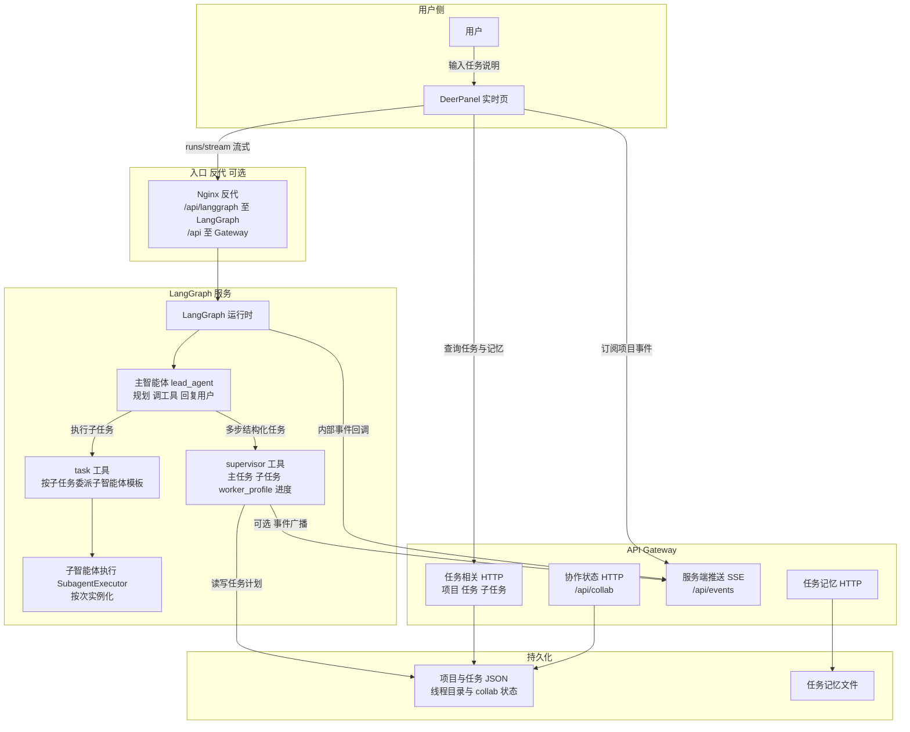

# 实时对话任务协作流程说明

本文说明：用户在 **DeerPanel 实时页面**发起对话、描述任务后，系统从浏览器到 **LangGraph 主智能体**、**supervisor / task 工具**、**API Gateway** 与持久化存储的**自上而下**数据流，以及各环节**由谁负责**。

---

## 一、整体是否贯通

在开发环境**按约定启动**（LangGraph、Gateway、前端；若经 Nginx，则 `/api/langgraph` 反代到 LangGraph、`/api/*` 到 Gateway），且 **`PYTHONPATH`、SSE 相关环境变量**（使 LangGraph 在需要时能向 Gateway 推送内部事件）配置正确时，下列链路在架构上是**闭环**的：

- 实时页发消息 → LangGraph **流式**运行 **主智能体（lead_agent）** → 可调用 **supervisor**、**task** 等工具 → 任务与记忆落在 **Gateway 侧存储与 HTTP API** → 页面可通过 **REST** 查询任务、子任务、`worker_profile`、任务记忆；项目级 **SSE**（`/api/events`）用于任务进度等实时推送（需广播路径可用）。

若某一环未启动或环境不对，常见现象是：对话流式正常，但**任务 API 无数据**，或 **SSE 无事件**。多为部署与配置问题，需对照脚本与环境变量排查。

---

## 二、自上而下流程图（职责）

---

## 三、分阶段说明（谁做什么）

| 阶段 | 做什么 | 主要由谁完成 |
|------|--------|----------------|
| 发起对话 | 用户在实时页输入自然语言任务 | **用户** |
| 会话与线程 | 绑定或创建 `thread_id`、会话映射 | **DeerPanel**（如 `ws-client.js`） |
| 提交运行 | `POST .../runs/stream`，流式返回模型与工具事件 | **DeerPanel →（Nginx）→ LangGraph** |
| 主智能体推理 | 理解意图、规划、是否进入复杂任务流程 | **lead_agent**（大模型 + 系统提示词） |
| 协作状态（可选） | 线程上协作阶段、`bound_task_id` 等与任务绑定 | **前端 / Gateway** 读写 **协作状态**；中间件可参与阶段约束 |
| 匹配或新建子任务 | 用 **`list_subtasks`** 对照模板能力与 `worker_profile`：能复用则不再 `create_subtask`，否则 **`create_subtask` + `assign_subtask`** | **主智能体** + **supervisor** |
| 任务编排 | 创建主任务、进度、完成、授权、读记忆等 | **主智能体** 调用 **supervisor**；**项目存储** 落盘 |
| 执行子工作 | 对子任务调用 **task**，按模板拉起子智能体执行 | **主智能体** 调用 **task** → **SubagentExecutor**（**按次**运行实例，非常驻操作系统进程） |
| 记忆与汇总 | 子任务 / 主任务记忆；聚合与 HTTP 查询 | **supervisor**、**task_memory** 等路由；**任务记忆存储** |
| 实时推送（可选） | 任务进度、完成、记忆更新等 | **Gateway 事件广播**；浏览器 **SSE**；LangGraph 需能访问 Gateway 回调（环境变量） |
| 展示与查询 | 任务列表、详情、`worker_profile`、记忆内容 | **用户** 在任务相关页面或通过 **Gateway REST**；**DeerPanel** 调用 API |

---

## 四、子智能体：先匹配再建，再分配（类型层 + 计划层）

这里的「子智能体」分两层理解：

1. **模板层（配置里有哪些类型）**  
   分配时使用的 `assigned_agent` 必须是已配置的**模板名**（如 `general-purpose`、`bash`、研究/写作等，以运行环境为准）。主智能体**不能**凭空造名字，只能在这些模板里选。

2. **计划层（当前主任务下已有哪些子任务行）**  
   每条子任务可带 **`worker_profile`**（期望的 `base_subagent`、工具、技能、依赖等），并可有 **`assigned_to`**（已分配模板）。

**推荐决策顺序（主智能体）**：

1. 已有主任务 `task_id` 时，先 **`supervisor(list_subtasks)`** 或 **`get_status`**，看清已有子任务的 **Agent 列**与 **profile 摘要**。  
2. **若能匹配**：存在一条子任务，其职责 / `worker_profile`（含 `base_subagent`、工具与技能约束）与当前工作项一致，且状态仍可用于继续执行 —— **不要**再 `create_subtask`；必要时只对未分配的条目调用 **`assign_subtask`**，执行阶段用 **`task`** 并带上 `collab_task_id` / `collab_subtask_id`。  
3. **若不能匹配**：再 **`create_subtask`**（可带 `worker_profile_json`），再 **`assign_subtask`** 指定模板，然后再 **`task`** 执行。

**与「临时」的关系**：复用的是**计划里的子任务行**和**模板类型**；每次 **`task`** 仍是一次**运行时实例**，这是正常的。

**并发与速度**：见下一节。

---

## 五、判断与创建能否「并发」、怎样更快

- **必须先做的**：对**同一主任务**的「看一眼已有子任务」至少 **`list_subtasks`（或 `get_status`）一次**，再决定复用或新建；否则容易重复建行。  
- **可以并发的典型情况**：  
  - 已读完列表后，对**多个相互独立**的新子任务（无 `depends_on` 交叉、或依赖已满足）在同一轮对话里**连续或并列**发起多个 `create_subtask` / `assign_subtask`（是否并行执行取决于 LangGraph/运行时对多工具调度的实现；存储侧通常有锁，实际可能串行写入，但能减少**往返轮次**）。  
- **不宜盲目并发的**：同一主任务下若并行多个写操作，在极端情况下需依赖存储锁；**有依赖顺序**的子任务（`depends_on`）应先创建被依赖项并拿到 ID，再创建依赖方。  
- **提速建议**：主智能体在**一轮**内用**并行 tool call**（若模型与上限允许）批量提交无依赖的 `create_subtask` + `assign_subtask`，比「一轮只建一个」少几轮对话。

---

## 六、与「临时子智能体」的区分

- **持久**：主任务与子任务记录、`worker_profile`、任务记忆、线程上的协作状态等，可通过 API 查询。
- **临时**：每一次 **task** 调用对应的**子智能体运行实例**（一次执行一轮），属于运行时行为，并非「每次新建一个全局唯一的工人进程」。

---

## 七、相关文档

- 代码是否支持先查询再建、数据存哪、前端两页长什么样：`docs/前端实时聊天与任务监控页面说明.md`
- 主智能体各阶段工具、参数与返回：`docs/主智能体工具调用与阶段说明.md`
- 多智能体协作设计与测试清单见仓库内同目录其他 `实时对话*`、`MULTI_AGENT*` 等文档（如有）。
- 部署与端口以 `scripts/dev-windows.ps1`、`docker/nginx` 配置为准。
