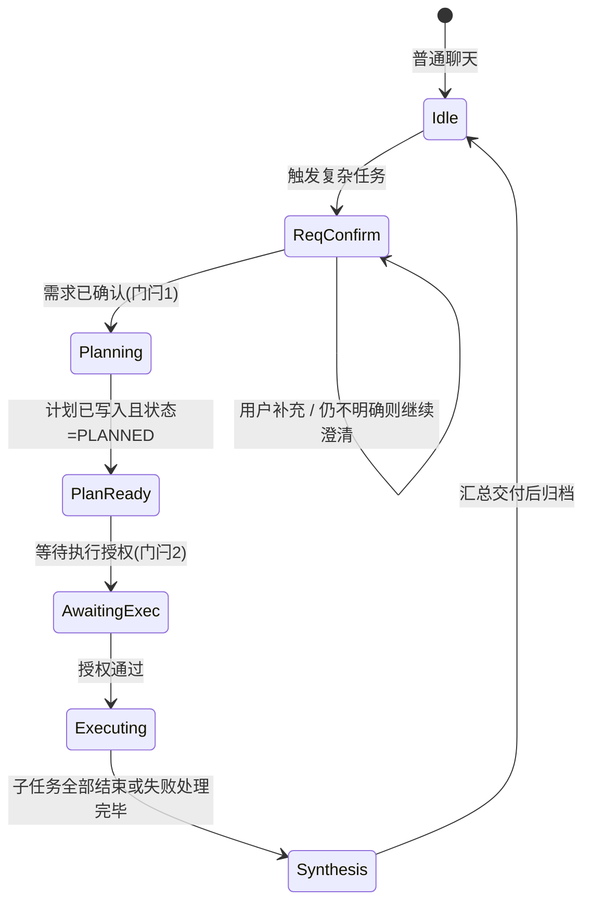

# 实时对话中的复杂任务：分阶段流程、参数传递与界面（详细设计）

> 版本：v1.0  
> 日期：2026-04-02  
> 关联：`docs/MULTI_AGENT_COLLABORATION_DESIGN.md`（总纲与数据结构）

本文把下面几件事 **一次性写清楚**：在实时对话里 **怎么开启** 复杂任务；开启后 **必经哪些阶段**（第一步是确认需求）；**规划**里智能体数量、技能、工具、提示词等 **参数怎么传、存在哪、谁读**；**规划之后** 为何不能立刻跑 Worker、**谁来下执行令**；执行期聊天区是否要 **切换/并列** 多智能体实时看板。

---

## 1. 目标行为（产品一句话）

用户在 **实时聊天** 里表达「这是一件要多步、多角色协作的事」→ 系统 **先对齐需求** → 再产出 **可审核的执行计划**（几个 Worker、每人能用哪些工具/技能、附加上下文提示）→ **显式门闩通过** 后 → 才允许 **`task` 真正拉起子智能体** → 执行期间用户既看到 **对话进展**，也能看到 **多路执行态势**（推荐独立视图或分栏，而不是纯文字淹没在聊天记录里）。

---

## 2. 在实时对话里「怎么开启」复杂任务

### 2.1 三种触发方式（可并存）

| 方式 | 说明 | 实现要点 |
|------|------|----------|
| **A. 自然语言意图** | 用户说「帮我做一个多步骤竞品分析」「开个复杂任务」等，Lead 在提示词约束下进入协作流程。 | 依赖 Lead 的 **模式识别**；建议在系统提示中列出 **强触发词** 与 **必须走的阶段**（见 §4）。 |
| **B. 显式指令** | 用户输入固定前缀，例如 `/collab` 或 `/复杂任务`，解析后 **置会话状态** `collab_mode=armed`，下一轮强制走 §4 流程。 | 聊天前端或 Gateway 在 **同 thread** 写入元数据（见 §6.1），避免模型漏阶段。 |
| **C. UI 开关** | 聊天顶栏 **「复杂任务」** 开关（见 §2.3）；打开后 **本会话** 标记为协作模式，并在发往 LangGraph 的 `context` 中启用子智能体与计划模式。 | 与 B 类似，**硬门** 优先于纯模型自由发挥。 |

**推荐组合**：**C（或 B）做硬门** + **A 做软触发**，减少「没确认需求就建任务」的漏网。

### 2.2 与「普通一问一答」的边界

- **未进入协作流程**：走现有单轮/多轮对话，**禁止** 调用 `supervisor(create_task)` 落持久化大任务（可在提示词中约束）。
- **已进入协作流程**（§2.1）：必须遵守 §4 阶段机；落库任务状态与门闩字段（§5、§6）。

### 2.3 DeerPanel「实时聊天」已实现的硬门（开关）

| 项 | 说明 |
|----|------|
| **位置** | 实时聊天页顶栏，在「模型」选择器右侧：**「复杂任务」** 复选框。 |
| **持久化** | 按 **会话**（`session_key`）存在浏览器 `localStorage` 的会话元数据字段 **`collabMode`**（与「闪速/Pro」等模式存在同一 map）。 |
| **运行时效果** | 开启：对该会话调用 `chatUpdateContext`，设置 `subagent_enabled: true`、`is_plan_mode: true`，与 DeerFlow `runs/stream` 请求体中的 `context` 合并（见 `deerpanel/src/lib/ws-client.js`）。关闭：按当前「模式」预设（闪速/思考/Pro/Ultra）重新应用 `applySessionModePreset`，再叠加 §2.3 关闭态（Ultra 仍可能保持 `subagent_enabled`，与原有 Ultra 行为一致）。 |
| **切换会话** | 自动同步开关 UI，并对该会话执行一次 **叠加**，避免上下文与开关不一致。 |
| **自检** | 用户可发 `/context`，输出中含一行 **`复杂任务开关(本地): 开|关`**。 |
| **后续实现** | 门闩强制、`worker_profile` 落库、`task` 校验、右侧多智能体看板等仍按 §6～§8 排期；**开关仅解决「能力是否注入」**，不替代阶段机。 |

---

## 3. 总体阶段机（必须先理解这张图）



- **门闩1（需求确认）**：从「想做大任务」到「可以写计划」——**第一步就是向用户确认需求**（范围、交付物、约束、截止时间等），未完成则 **不进入 Planning**。
- **门闩2（执行授权）**：从「计划已写好」到「可以调 `task`」——**只需满足其一**：主智能体在对话中明确下达执行指令 **或** 用户点击确认（二选一放行，见 §5.3）。

---

## 4. 分阶段详解：每一步谁做什么、对外呈现什么

### 阶段 0：Idle → 触发

- **输入**：用户消息或 `/collab` / **顶栏「复杂任务」开关**（§2.3）。
- **系统**：thread 标记 `collab_phase`（见 §6.1）；可选向用户展示一行系统提示：「已进入复杂任务模式：将先确认需求，再给出计划，经确认后执行。」

### 阶段 1：需求确认（ReqConfirm）——**第一步**

- **负责方**：Lead Agent（主智能体）。
- **允许的工具**：`ask_clarification`（推荐）、纯文本追问；**不应** 在此阶段调用 `supervisor(create_task)` 写入完整执行树（避免需求未清就落库）。
- **结束条件（门闩1）**：  
  - 用户在对话中 **明确确认**（例如「可以，按这个做」）。
  - 模型侧不得在用户未确认的情况下沉默自动进入规划（产品固化：**需求强确认**）。
- **持久化（可选）**：可仅保存在 **对话消息** 中；若需审计，可写入 `task` 草稿：`status=DRAFT` 或单独 `collab_intent` 记录，**不进入 PLANNED**。

### 阶段 2：规划（Planning）

- **负责方**：Lead Agent（上帝视角规划）。
- **必须产出（逻辑上）**：
  1. **拆成几个 Worker**（子任务条数 = 并行/串行拓扑上的节点数）。
  2. 每个 Worker 的 **worker_profile**（见 §5.2）：基底角色、可用工具、可用技能、专属提示补充。
  3. **依赖关系**（谁先谁后）。
- **工具调用**：`supervisor`  
  - `create_task`：建主任务，**status 建议为 `planning` 或 `planned`**（与存储枚举对齐）。  
  - 对每个子任务：`create_subtask`，并在存储中写入 **`worker_profile`**（与 REST 扩展字段一致）。  
  - **不在此阶段** 调用 `task` 执行 Worker。
- **对用户展示**：在聊天里用结构化摘要展示计划表（表格或列表）；**同时** 应用 §7 的「协作看板」占位或实时同步（见 §7）。

### 阶段 3：计划就绪（PlanReady）与执行门闩（AwaitingExec）

- **存储状态**：主任务 `status = PLANNED`（或等价枚举），表示「计划已冻结，等待执行授权」。
- **门闩2：双重抉择（任一放行，固化）**：

| 模式 | 含义 | 谁放行 |
|------|------|--------|
| **用户确认** | 聊天内展示「确认执行 / 修改计划」按钮或用户回复「确认执行」 | 用户 |
| **主智能体命令** | Lead 在计划展示后 **再发一轮**，调用新工具 `supervisor(action=start_execution, task_id=...)` 或显式 `execute_plan` | Lead |

**硬性规则**：在门闩2 通过之前，**禁止** 调用 `task(...)` 启动任何 Worker。实现上可在 **工具层** 校验：若 `task` 关联的 `task_id` 未通过任一放行路径（用户确认 或 主智能体 `start_execution`）且无法满足 `thread_id` 绑定，则 **直接拒绝并返回错误说明**。

### 阶段 4：执行（Executing）

- **负责方**：Lead 按拓扑顺序（或并行批次）调用 **`task`**，把 §5.2 的 **同一套 worker_profile** 通过参数传给子智能体（见 §5.4）。
- **状态迁移**：首个 `task` 调用前：`supervisor` 或存储 API 将主任务置为 `EXECUTING`。
- **观测**：SSE / 流式事件推送子任务状态；界面见 §7。

### 阶段 5：汇总（Synthesis）

- Lead 汇总各 Worker 结果，对用户交付；`supervisor` 更新完成状态。

---

## 5. 参数传递：技能、工具、提示词从哪里来、存哪、怎么执行

### 5.1 概念模型：三层数据

| 层级 | 内容 | 典型消费者 |
|------|------|------------|
| **全局目录** | 当前部署下 **全部可用工具名**（来自 `get_available_tools` 配置）、**全部已启用技能名**（来自 `load_skills`） | Lead 规划时「选材」；校验器过滤非法名 |
| **计划实例（每任务一份）** | 每个子任务一条 **worker_profile** | 持久化在 Task/Subtask 上；执行时原样传给 `task` |
| **运行时注入** | `SubagentExecutor` 用 `worker_profile.tools` 做白名单、`worker_profile.skills` 传给 `get_skills_prompt_section`、拼接 `worker_profile.instruction` | `task` 工具内部 |

### 5.2 worker_profile 推荐 JSON 形状（单个子任务）

```json
{
  "base_subagent": "general-purpose",
  "tools": ["read_file", "web_search", "write_file"],
  "skills": ["feishu-bitable", "canvas"],
  "instruction": "你只负责竞品公开信息搜集，不要猜测财务数据；输出用表格。",
  "depends_on": ["a1b2c3d4"]
}
```

| 字段 | 含义 | 传递与校验 |
|------|------|------------|
| `base_subagent` | 选用哪套内置子 Agent 模板（`SubagentConfig` 名），如 `general-purpose`、`bash` | `task(subagent_type=base_subagent)` |
| `tools` | **允许使用的工具名列表**（白名单）；`null`/缺省表示用该 base 模板默认 | `SubagentConfig.tools` 覆盖；执行前与全局工具列表 **求交** 防止幻觉名 |
| `skills` | **允许注入的技能名列表**；`null`/缺省表示注入全部已启用技能或按产品策略 | `get_skills_prompt_section(set(skills))` |
| `instruction` | **该 Worker 的附加系统指令**（在基底 prompt 之上） | 拼到子 Agent `system_prompt` 前部或尾部（与现有 `task` 实现对齐） |
| `depends_on` | 依赖的子任务 id | 执行编排器或 Lead 在调用 `task` 前检查 |

**存放位置**：

- **子任务**：存在 **主任务对象的 `subtasks[]`** 每一项上，字段名建议统一 `worker_profile`（实现待对齐）。
- **主任务级元数据**（`execution_authorized`、`thread_id` 等）：存在 **主任务** 对象上；持久化文件里与主任务同列于存储桶的 `tasks[]`（见 §6.3）。

### 5.3 主任务 / 计划级元数据（与 thread 关联）

```json
{
  "id": "task主键",
  "status": "planned",
  "execution_authorized": false,
  "authorized_at": null,
  "authorized_by": "user|lead",
  "thread_id": "与 LangGraph 会话一致",
  "subtasks": [ { "id": "...", "worker_profile": { } } ]
}
```

- **`execution_authorized`**：门闩2；仅在为 `true` 后允许 `task` 工具对本子任务执行（或由编排器批量置 `true`）。
- **`thread_id`**：创建 `create_task` 时由 **运行时注入** `runtime.context`（若当前实现缺，则需在 Gateway/LangGraph 调用链传入 configurable）。

### 5.4 从存储到 `task` 工具：执行时怎么传

执行某子任务 `subtask_id` 时，**必须从存储读取** 对应 `worker_profile`，并映射为 `task` 调用，例如（逻辑示意）：

```text
task(
  description="短标签",
  prompt="用户可见的任务说明+上下文",
  subagent_type=worker_profile.base_subagent,
  allowed_tool_names=json.dumps(worker_profile.tools),
  allowed_skill_names=json.dumps(worker_profile.skills),
  worker_instructions=worker_profile.instruction
)
```

（具体参数名以实现为准；关键是 **计划与执行使用同一结构**，避免 Lead 现场编造与库内不一致。）

---

## 6. 后端与工具契约（实现清单）

### 6.1 Thread / 会话元数据（建议）

与 LangGraph `thread_id` 绑定一条可查询状态（Redis 或线程扩展字段）：

```json
{
  "thread_id": "xxx",
  "collab_phase": "req_confirm|planning|awaiting_exec|executing|done",
  "bound_task_id": "主任务 id，可为 null",
  "bound_project_id": "与 HTTP 字段 parent_project_id 同义：持久化存储桶 id（路径名历史为 project_*，产品语义上不是「项目」）"
}
```

聊天前端根据 `collab_phase` 决定 **是否展示协作看板**、是否禁用普通快捷指令等（可选）。

### 6.2 `supervisor` 工具扩展（相对现状）

| 新增或调整 | 目的 |
|------------|------|
| `create_task` 时写入 `thread_id`、`status` | 关联对话与计划 |
| `create_subtask` 接受 `worker_profile` JSON 或平铺字段 | 规划期落完整参数 |
| **`start_execution` 或 `authorize_execution`** | 门闩2：仅在此 action 后将 `execution_authorized=true` 或 `status→executing` |
| `task` 工具前置校验 | 读存储：未授权则返回明确错误，防止跳过确认 |

### 6.3 任务中心 HTTP（**一条任务规划其下子任务**）

**产品语义**：用户只关心 **任务**；**规划**产出的是该任务下的 **`subtasks[]`**。持久化仍使用历史文件名 `project_{id}.json`（内层字段 `tasks[]`），HTTP 里用 **`parent_project_id`** 指该文件 id（与 `task-memory`、`/api/events` 中的 `project_id` **同值**）。**不要把「项目」当作并列业务对象**；`/api/projects` 仅兼容与调试。

#### 6.3.1 主任务对象字段（JSON，核对用）

| 字段 | 类型 | 必填/常态 | 说明 |
|------|------|-----------|------|
| `id` | string | 有 | 短 id（实现为 uuid 截断） |
| `name` | string | 有 | 任务标题 |
| `description` | string | 有 | 任务描述 |
| `status` | string | 有 | 见下表「状态枚举」 |
| `parent_id` | string \| null | 有 | 顶层主任务一般为 `null` |
| `subtasks` | array | 视创建路径 | **`POST /api/tasks` 创建的主任务带 `subtasks: []`**；经 `POST /api/projects/.../tasks` 创建的顶层任务可能 **无此键**，客户端宜按 `[]` 处理 |
| `dependencies` | string[] | 视创建路径 | 部分路径写入（如 projects 下添加任务）；`POST /api/tasks` 初始体可能 **无此键** |
| `assigned_to` | string \| null | 有 | 指派的主执行体 id，可空 |
| `result` | any \| null | 有 | 执行结果 |
| `error` | string \| null | 有 | 失败信息 |
| `created_at` | string | 有 | ISO8601，后缀 `Z` |
| `started_at` | string \| null | 有 | 进入执行等时机写入 |
| `completed_at` | string \| null | 有 | 完成/失败等时机写入 |
| `progress` | int | 有 | 0–100 |
| **`worker_profile`** | object | **目标** | §5.2，**当前多数未落库** |
| **`execution_authorized`** | bool | 有 | §5.3 门闩；默认 `false`；**`POST .../authorize-execution` 置 `true`**（`task` 工具强制校验见 §8） |
| **`authorized_at`** | string \| null | 有 | 授权时间 ISO8601 |
| **`authorized_by`** | string \| null | 有 | `user` / `lead` / `system` 等 |
| **`thread_id`** | string \| null | 有 | **`POST /api/tasks` 可写入**；**`supervisor(create_task)`** 从运行时 `context/configurable` 注入 |

**列表/详情接口额外注入字段**（仅 HTTP 层，不在磁盘任务对象上单独存一份）：

| 字段 | 类型 | 说明 |
|------|------|------|
| `parent_project_id` | string | 存储桶 id；**`GET /api/tasks`、`GET /api/tasks/{id}` 有** |
| `project_name` | string | 存储桶侧名称；**`POST /api/tasks` 创建时默认 `任务: {name}`** |

**状态枚举**（与 `deerflow.collab.models.TaskStatus` 一致，小写字符串）：  
`pending` | `planning` | `planned` | `executing` | `paused` | `completed` | `failed` | `cancelled`

#### 6.3.2 子任务对象字段（JSON，`subtasks[]` 元素）

| 字段 | 类型 | 说明 |
|------|------|------|
| `id` | string | 子任务 id |
| `name` | string | |
| `description` | string | |
| `status` | string | 同上枚举 |
| `dependencies` | string[] | 依赖的 **子任务 id** |
| `assigned_to` | string \| null | |
| `result` | any \| null | |
| `error` | string \| null | |
| `created_at` | string | |
| `started_at` | string \| null | |
| `completed_at` | string \| null | |
| `progress` | int | 0–100 |
| **`worker_profile`** | object | **目标**，§5.2；**当前未落库** |

#### 6.3.3 `/api/tasks` 重要接口（方法、路径、请求体、响应体）

**`GET /api/tasks`** — 任务列表  

- **响应**：`array`，每项 = **主任务对象** + `parent_project_id` + `project_name`。  
- **排序**：按 `created_at` **倒序**。

**`GET /api/tasks/{task_id}`** — 任务详情（含规划出的子任务）  

- **响应**：**主任务对象**（含 `subtasks`）+ `parent_project_id` + `project_name`。  
- **404**：找不到该 `task_id`。

**`POST /api/tasks`** — 创建主任务（并新建仅含这一条主任务的存储桶）  

- **请求体 JSON**：

| 字段 | 类型 | 必填 |
|------|------|------|
| `name` | string | 否（默认可空） |
| `description` | string | 否 |
| `thread_id` | string | 否 | 绑定 LangGraph 会话 |

- **响应**：新建主任务 + **`parent_project_id`**、**`project_name`**（与 `GET /api/tasks/{id}` 对齐，减少一次拉取）。

**`PUT /api/tasks/{task_id}`** — 更新主任务  

- **请求体 JSON**（字段均可选，只传要改的）：

| 字段 | 类型 |
|------|------|
| `name` | string |
| `description` | string |
| `status` | string |
| `progress` | int |

- **响应**：更新后的主任务对象（**仍无** `parent_project_id` 注入，与实现一致）。  
- **副作用**：`status` 为 `executing` 时可能自动补 `started_at`；`completed` / `failed` 时可能补 `completed_at`。

**`DELETE /api/tasks/{task_id}`** — 删除主任务  

- **响应**：`{ "success": true, "message": "Task '{task_id}' deleted" }`  
- **副作用**：若该存储桶内仅此一条主任务，**整桶删除**。

**`POST /api/tasks/{task_id}/start`** — 标记进入规划（与存储一致）  

- **响应**：`{ "success": true, "message": "Task started planning", "task_id": "<id>" }`  
- **副作用**：该主任务与所属存储桶 `status → planning`。

**`POST /api/tasks/{task_id}/stop`** — 暂停  

- **响应**：`{ "success": true, "message": "Task stopped", "task_id": "<id>" }`  
- **副作用**：主任务与存储桶 `status → paused`。

**`POST /api/tasks/{task_id}/authorize-execution`** — 门闩2：允许执行（写 `execution_authorized`）  

- **请求体 JSON**（可选）：`authorized_by`（string，默认 `user`）。  
- **前置条件**：主任务 `status` 为 **`planned` 或 `planning`**；已为 `true` 时 **幂等** 返回成功。  
- **响应**：`success`、`task_id`、`message`、`execution_authorized`；首次授权含 `authorized_at`、`authorized_by`。  
- **错误**：状态不允许时 **400**；找不到任务 **404**。  
- **说明**：**不**自动把 `status` 改为 `executing`（与「先授权再调 `task`」一致）。

**`task` 工具（协作门闩，C-03）** — 与 HTTP 同源校验  

- 当模型传入 **`collab_task_id=<主任务 id>`** 或运行时 **`context.collab_task_id`** 有值时：从存储读取该主任务，要求 **`execution_authorized === true`**；若任务上 **`thread_id` 已绑定**，则当前运行的 **`thread_id` 必须一致**，否则拒绝且不启动子智能体。  
- **未传** `collab_task_id` 且 context 无该键时：**不**做上述校验（兼容普通子智能体委派）。

**`supervisor` 工具 `start_execution`（C-02）** — 与授权 API 同源  

- **`action=start_execution`**，**`task_id`** 必填；可选 **`authorized_by`**（默认 **`lead`**）。逻辑与 **`POST .../authorize-execution`** 相同（`planned` / `planning`、幂等）。

**`GET /api/tasks/{task_id}/subtasks`**  

- **响应**：`array`，即主任务的 `subtasks`（缺省视为 `[]`）。

**`POST /api/tasks/{task_id}/subtasks`** — 规划/新增子任务  

- **请求体 JSON**：

| 字段 | 类型 | 必填 |
|------|------|------|
| `name` | string | 否 |
| `description` | string | 否 |
| `dependencies` | string[] | 否，默认 `[]` |

- **响应**：新建的子任务对象。

**`GET /api/tasks/{task_id}/subtasks/{subtask_id}`**  

- **响应**：单个子任务对象。

**`PUT /api/tasks/{task_id}/subtasks/{subtask_id}`**  

- **请求体 JSON**（均可选）：

| 字段 | 类型 |
|------|------|
| `name` | string |
| `description` | string |
| `status` | string |
| `assigned_to` | string |
| `progress` | int |

- **响应**：更新后的子任务对象。`status` 触发时刻字段逻辑同主任务。

**`DELETE /api/tasks/{task_id}/subtasks/{subtask_id}`**  

- **响应**：`{ "success": true, "message": "Subtask '{subtask_id}' deleted" }`

**`POST /api/tasks/{task_id}/subtasks/{subtask_id}/assign`**  

- **请求体 JSON**：`{ "agent_id": "<string>" }`  
- **响应**：`{ "success": true, "message": "Subtask assigned to <agent_id>" }`

#### 6.3.4 任务记忆 `/api/task-memory`（进度、摘要、事实；与主任务 id 关联）

**`GET /api/task-memory/tasks/{task_id}`**  

- **响应 JSON**（字段名固定）：

| 字段 | 类型 |
|------|------|
| `task_id` | string |
| `agent_id` | string | 来自主任务 `assigned_to`，空串表示未指派 |
| `project_id` | string | **等于** 主任务的 `parent_project_id`（存储桶 id） |
| `status` | string |
| `facts` | array | 元素见下表 |
| `output_summary` | string |
| `current_step` | string |
| `progress` | int |
| `created_at` | string |
| `updated_at` | string |
| `completed_at` | string \| null |

**`facts[]` 元素**（写入/读出一致）：

| 字段 | 类型 |
|------|------|
| `id` | string |
| `content` | string |
| `category` | string | 如 `finding` |
| `confidence` | number | 0–1 |
| `source_message` | string \| null |

**`POST /api/task-memory/tasks/{task_id}/facts`**  

- **请求体 JSON**：`content`（string），`category`（string，默认 `finding`），`confidence`（number，默认 `0.5`），`source_message`（string，可选）。  
- **响应**：`{ "success": true, "fact": { ... } }`

**`PUT /api/task-memory/tasks/{task_id}/progress`**  

- **请求体 JSON**：`progress`（int），`current_step`（string）。  
- **响应**：`{ "success": true, "progress": <int>, "current_step": "<string>" }`  
- **副作用**：会同步更新主任务对象上的 `progress`。

**`GET /api/task-memory/projects/{project_id}/facts`** — 桶级事实汇总  

- **响应**：`{ "project_id", "facts": [...], "total": <int> }`

**`GET /api/task-memory/projects/{project_id}/status`** — 桶内运行态摘要  

- **响应**：`{ "project_id", "agents": [...], "tasks": [...] }`（`tasks` 为桶内主任务列表；`agents` 来自运行时存储聚合）

#### 6.3.5 SSE `GET /api/events/projects/{project_id}/stream`

- **路径参数**：`project_id` = 主任务的 **`parent_project_id`**。  
- **事件负载**（`data:` 行 JSON）：`type`、`project_id`、`data`（对象）、`timestamp`（ISO8601）。  
- **常见 `type`**：`task:created`、`task:started`、`task:progress`、`task:completed`、`task:failed`、`task:heartbeat`、`task_memory:updated`、`project:updated`（具体 `data` 内字段以实现广播处为准）。

#### 6.3.6 规划中（尚未实现路由）

| 路径 | 用途 |
|------|------|
| 可选：`GET /api/events/tasks/{task_id}/stream` | 仅 `task_id` 订阅时可做网关封装 |

#### 6.3.7 兼容：`/api/projects`（路径名历史遗留）

- **`GET /api/projects`** 摘要项字段：`id`、`name`、`description`、`status`、`created_at`、`updated_at`、`task_count`。  
- **`GET /api/projects/{project_id}`**：整桶 JSON，含顶层 `tasks[]`（其内主任务结构同 §6.3.1）。与 **`GET /api/tasks/{task_id}`** 数据同源，仅入口不同。

**只读拉取计划与配置（目标态）**：详情中应能读到 **`worker_profile`、授权状态**；当前以磁盘是否写入为准，与 §8 对齐。

### 6.4 上帝智能体（Supervisor）如何查询子智能体记忆、事实与执行进度

**先分清两条数据源**：

| 数据源 | 存什么 | 典型用途 |
|--------|--------|----------|
| **任务树（存储桶 JSON）** | 主任务 / 子任务的 `status`、`progress`、`assigned_to`、时间戳、`result` / `error` | 「做到哪一步」「谁负责」「完成没有」——**结构进度** |
| **TaskMemory（`.deer-flow/task_memory/...`）** | `facts[]`、`current_step`、`output_summary`、以及文件内的 `progress` | **执行过程摘要、抽取事实、当前步骤文案** |

子智能体通过 `task` 等工具跑起来后，**是否写入 TaskMemory** 取决于运行时是否更新记忆（例如调用 `POST/PUT /api/task-memory/...`）。与 **主任务 id / 子任务 id** 的对应关系要有约定，否则 Supervisor 会对不上号（见 §6.4.4）。

#### 6.4.1 查什么（对照字段）

| 目的 | 查什么 |
|------|--------|
| 每个子任务是否在跑、百分比、指派给谁 | 子任务对象：`status`、`progress`、`assigned_to`、`started_at`、`completed_at` |
| 主任务整体进度（若只维护在主任务上） | 主任务：`progress`；或与子任务聚合（产品策略） |
| 子智能体产出的**事实** | TaskMemory：`facts[].content` / `category` / `confidence` / `source_message` |
| **当前步骤**（给人看的短句） | TaskMemory：`current_step` |
| **阶段输出摘要** | TaskMemory：`output_summary` |
| 跨子任务、桶级沉淀的事实 | `GET /api/task-memory/projects/{project_id}/facts` → `facts[]` |
| 谁在跑、心跳式进度 | `GET /api/task-memory/projects/{project_id}/status` 的 `agents[]`；或 SSE `task:heartbeat`、`task:progress` |

#### 6.4.2 怎么查（HTTP）

| 场景 | 方法 | 路径 | 说明 |
|------|------|------|------|
| 主任务 + 全部子任务（结构进度） | GET | `/api/tasks/{task_id}` | 含 `subtasks[]`，每条有 `status`、`progress` 等 |
| 仅子任务列表 | GET | `/api/tasks/{task_id}/subtasks` | |
| **主任务** 的 TaskMemory | GET | `/api/task-memory/tasks/{task_id}` | **`task_id` 必须是主任务 id**（见 §6.4.4） |
| 按智能体汇总其相关任务与 memory | GET | `/api/task-memory/agents/{agent_id}` | 返回结构中含 `task` + `memory` |
| 桶级事实汇总 | GET | `/api/task-memory/projects/{parent_project_id}/facts` | `parent_project_id` 同 `GET /api/tasks/...` 返回的 `parent_project_id` |
| 桶内运行态（agents + 主任务列表） | GET | `/api/task-memory/projects/{parent_project_id}/status` | |
| 实时事件 | GET (SSE) | `/api/events/projects/{parent_project_id}/stream` | 进度、完成、心跳等 |

#### 6.4.3 怎么查（当前 `supervisor` 工具，模型可直接调用的部分）

工具名：`supervisor`（`deerflow/tools/builtins/supervisor_tool.py`）。

| 目的 | `action` | 必填参数 | 模型能读到的内容 |
|------|----------|----------|------------------|
| 主任务 + 子任务状态总览 | `get_status` | `task_id` | 主任务 `status`/`progress`；每个子任务名称、`status`、id |
| 子任务列表（含代理与进度） | `list_subtasks` | `task_id` | 每条子任务 `status`、`assigned_to`、`progress`、`id` |

**未覆盖**：`facts`、`current_step`、`output_summary` **没有** 对应的 `supervisor` action；若要让上帝智能体在对话里读 TaskMemory，需要 **扩展工具**（例如新增 `get_task_memory` / `list_facts`）或由 **Gateway 封装 HTTP** 再暴露给模型。

#### 6.4.4 实现缺口（子任务 id 与 TaskMemory）

- 网关 **`GET /api/task-memory/tasks/{task_id}`** 只在存储桶顶层 **`tasks[]` 里用 id 查找**；**不会**在 `subtasks[]` 里匹配。
- 因此：传 **子任务 id** 通常 **404**；当前路径下读 TaskMemory 事实/步骤，**语义上是「主任务维度」**，且 `agent_id` 来自**主任务**的 `assigned_to`（未指派时为空串，文件键仍可能存在）。
- **若要对每个子任务单独记事实**：需在存储层用 `(project_id, agent_id, subtask_id)` 读写，并 **扩展查询接口**（或在 `GET .../tasks/{id}` 内嵌每个子任务的 memory 摘要）。

---

## 7. 聊天界面与「实时多智能体」显示

### 7.1 问题：执行过程中聊天界面要不要切？

**建议：采用「分栏 / 抽屉」，不替代聊天记录。**

| 区域 | 内容 |
|------|------|
| **左侧或主列（保留）** | 原有 **实时对话**：需求确认、计划说明、主智能体总结、用户指令。 |
| **右侧或底部抽屉（执行期出现）** | **多智能体执行看板**：每个 Worker 一行/卡片：状态、当前步骤、进度条、所用工具/技能摘要；可点击展开日志。 |
| **数据来源** | `task_id` → `GET /api/tasks/...`；SSE 使用 **`parent_project_id`（存储桶 id）** → `GET /api/events/projects/{project_id}/stream`；与 `MULTI_AGENT_COLLABORATION_DESIGN` 中的监控面板一致。 |

### 7.2 何时显示看板

- **触发**：`collab_phase` 进入 `planning` 可显示「计划预览」占位；进入 `executing` **必须** 显示实时看板（或全屏可切换）。
- **IM 渠道**：无分栏时，可用 **富文本卡片** 或 **链接** 打开 DeerPanel 只读看板（产品决定）。

### 7.3 与「任务中心」关系

- **任务中心 / 任务详情页**：与看板 **数据同源**；聊天内嵌看板是 **轻量同构视图**，避免用户跳转丢失上下文。

---

## 8. 与现有代码的差距（实现前自检）

下列表格可作 **排期 / 联调 checklist**：实现某行时，在 PR 或工单里标明对应 § 节。

### 8.1 核心差距（原表 + 合并表述）

| 类别 | 项 | 现状（简述） | 目标或备注 |
|------|-----|----------------|------------|
| 门闩与阶段 | 两阶段门闩 | **`execution_authorized` + HTTP / `supervisor(start_execution)`**；**`task` 在传入 `collab_task_id`（或 `context.collab_task_id`）时** 校验授权与 `thread_id` 绑定 | 需求确认（门闩1）仍主要靠提示词；未传 `collab_task_id` 时 **`task` 行为与旧版一致**（不强制门闩） |
| 门闩与阶段 | 授权 API | **`POST .../authorize-execution` 已实现**（`planned`/`planning` + 幂等） | §6.3.3 |
| 阶段机元数据 | `collab_phase` / `bound_task_id` | §6.1 建议的 thread 元数据 **未** 持久化；与 DeerPanel 开关、任务 API **未同步** | Redis 或可查询 thread 扩展；与 §4 状态机一致 |
| 规划数据 | `worker_profile` | 子任务无结构化 tools/skills/instruction；`supervisor(create_subtask)` **无** 对应参数 | §5.2 落库 + §5.4 `task` 传参 |
| 规划数据 | `task` 工具签名 | 与设计 §5.4（白名单技能/工具、worker 指令等）**未完全对齐** | 扩展参数并由 `SubagentExecutor` 消费 |
| 关联 | thread ↔ 任务 | 任务对象 **未** 可靠写入 LangGraph `thread_id`；`supervisor_session_id` 未强绑定 | `create_task` / 网关创建时注入 |
| 关联 | 双路径建任务 | **`POST /api/tasks`** 与 **`supervisor(create_task)`** 各建一套存储；对话与面板 **易不同步** | 统一入口或创建后互写 `thread_id`/会话绑定 |
| UI | 聊天与看板 | **§2.3 开关已有**；**无** §7 分栏看板、无稳定 SSE 消费闭环 | 分栏 + `GET /api/events/projects/.../stream` |
| 上下文 | Lead 能力 | **`subagent_enabled` + `is_plan_mode`** 已注入 | 与 Lead **工具列表、提示词**显式对齐 §4～§5 |
| Supervisor | 读 TaskMemory | 仅 `get_status` / `list_subtasks`，**无** facts / `current_step` / `output_summary` | §6.4：新 action 或封装 HTTP |
| TaskMemory | 子任务粒度 | `GET /api/task-memory/tasks/{id}` **只匹配主任务** | §6.4.4：子任务 id 存取与查询 |

### 8.2 补充差距（观测、实现缺陷、软约束）

| 类别 | 项 | 现状（简述） | 目标或备注 |
|------|-----|----------------|------------|
| 观测 | SSE 生产者 | 路由已有；**执行流水线是否稳定 `emit_*`** 需核对 | 工具/Runner 在进度、完成、心跳处广播 |
| 观测 | 子智能体 → TaskMemory | **无** 约定清晰的自动写入链路（谁、何时、用哪个 task_id） | 与 §6.4、Worker 执行契约对齐 |
| 实现缺陷 | `supervisor(update_progress)` | 代码中进度值 **恒为 0**，未接收参数 | 修复并支持主任务/子任务进度 |
| 触发 | `/collab` 等指令 | §2.1 B：**未**解析并写 thread 元数据 | 与 `collab_phase` 持久化一起做 |
| 软约束 | 未进协作禁止 `supervisor` | §2.2 目前主要靠 **提示词** | 可选：网关/工具层拒绝或降级 |
| 工具对齐 | `ask_clarification` | §4 阶段 1 提及；是否与 **实际 Lead 工具集** 一致需核对 | 有则绑定门闩1；无则改文档或补工具 |
| 产品依赖 | §9 产品拍板已确认 | 门闩2 模式、强确认、看板强制、工具名校验策略 已固化 | 后续仅按实现/回归执行 |

---

## 9. 产品拍板（最终）

1. **门闩2**：**任一放行**（主智能体 `start_execution` 或用户确认其一即可）。  
2. **需求确认**：采用 **强确认**（未用户确认不得沉默进入规划）。  
3. **看板**：**执行期强制出栏**（桌面右侧栏 / 移动端全屏页），并在进入执行前 **强制弹窗确认**。  
4. **工具名校验**：白名单与全局列表不一致时 **静默跳过/丢弃**（不打回计划）。

---

## 10. 文档关系

| 文档 | 内容 |
|------|------|
| `MULTI_AGENT_COLLABORATION_DESIGN.md` | 总目标、记忆、API 清单、前端监控大纲 |
| **本文 `docs/实时对话多智能体协作设计.md`** | **实时对话如何开启、分阶段流程、参数怎么传、执行门闩、聊天与看板如何配合；含 DeerPanel 开关说明（§2.3）** |
| `实时对话多智能体协作-实施任务清单.md` | **实施任务 ID、详细描述、阶段依赖、处理进度总表（与 §8 对齐）** |

旧英文名 `MULTI_AGENT_CHAT_INITIATION_DESIGN.md` 已废弃，以本文为准。
